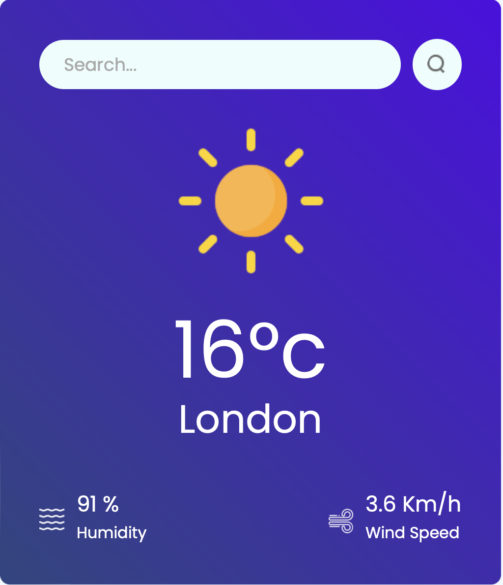

****

# Weather App 🌦️

Welcome to **Weather App**! This sleek, responsive application provides real-time weather updates for any location worldwide. Built with **Vite** and **React**, it delivers fast and reliable data to keep users informed on current and upcoming weather conditions.

## Features ✨

- **Instant Weather Updates**: Access current weather details for any location.
- **Forecasting**: View multi-day forecasts to plan ahead.
- **User-Friendly Interface**: Modern, easy-to-navigate design.
- **Responsive Layout**: Optimized for desktop, tablet, and mobile.

## Technologies Used 🔧

- **Vite**: A high-speed frontend build tool for fast development.
- **React**: A JavaScript library for building a responsive UI.
- **Weather API**: Pulls real-time weather data. Check out the [Weather API](https://openweathermap.org/current) for more information.

## Getting Started

Try the live app [here](https://example.com/your-live-app-link).

To run locally:

1. **Prerequisites**: Install **Node.js** (v14+) and **npm**.
2. **Clone and Install**:
   - Clone the repo: `git clone https://github.com/YvannGuy/weather-app-react-vite`
   - Navigate to the project directory: `cd weather-app-react-vite`
   - Install dependencies: `npm install`
3. **Setup**: Create a `.env` file in the root and add your API key:
   - `VITE_APP_ID=your_api_key_here`
4. **Run the App**: Start the server with `npm run dev` and open `http://localhost:5173`.

## Usage

- Enter a city name to retrieve the latest data.
- View metrics like temperature, humidity, and wind speed.

## Contributing

Contributions are welcome! Feel free to submit a pull request or open an issue.

## Acknowledgements

Special thanks to **Vite**, **React**, and our [Weather API provider](https://openweathermap.org) for making this app possible.
